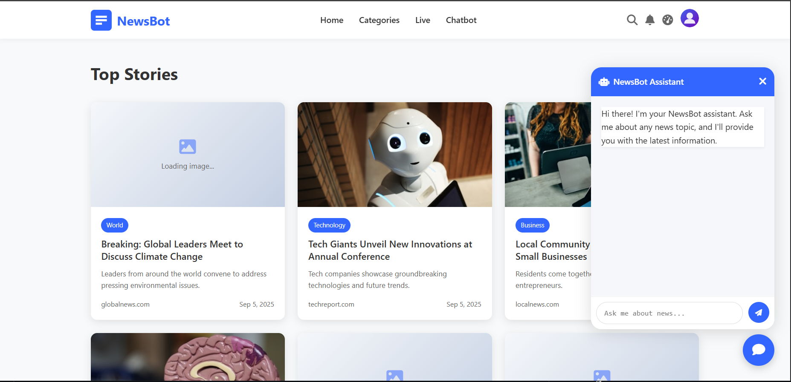
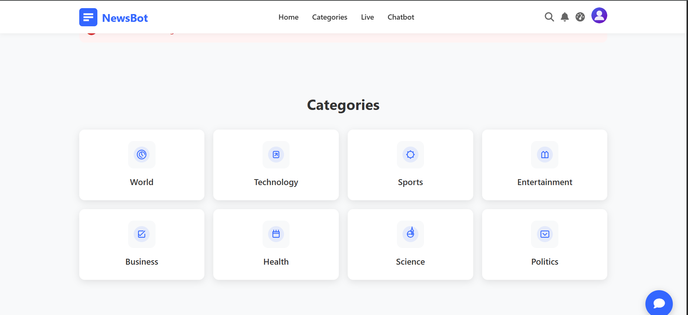

# 🤖 NewsBot - AI-Powered News Assistant

[](https://opensource.org/licenses/MIT)
[](https://nodejs.org/)
[](https://expressjs.com/)
[](https://ai.google.dev/)

> An intelligent news chatbot powered by Google's Gemini AI that provides real-time news updates, summaries, and analysis across multiple categories.




## 📋 Table of Contents

- [Features](#-features)
- [Demo](#-demo)
- [Installation](#-installation)
- [Configuration](#-configuration)
- [Usage](#-usage)
- [API Endpoints](#-api-endpoints)
- [Project Structure](#-project-structure)
- [Technologies Used](#-technologies-used)
- [Contributing](#-contributing)
- [License](#-license)
- [Contact](#-contact)

## ✨ Features

### 🎯 Core Capabilities
- **Real-time News Updates**: Get the latest news across multiple categories
- **AI-Powered Responses**: Leverages Google's Gemini 1.5 Flash model for intelligent conversations
- **Multi-Category Coverage**: World, Technology, Sports, Entertainment, Business, Health, Science, Politics
- **News Summarization**: Concise summaries of complex news stories
- **Fact-Checking**: Helps verify information and distinguish reliable sources
- **Historical Context**: Provides background information for current events

### 🎨 User Interface
- **Modern Responsive Design**: Clean, professional interface that works on all devices
- **Interactive Chat Interface**: Real-time messaging with formatted responses
- **Multiple Page Navigation**: About, Contact, Privacy, Terms, Help, Dashboard
- **User Account Management**: Account page for user preferences
- **Bookmarking System**: Save interesting news articles and topics
- **Status Monitoring**: Server status and health monitoring

### 🔧 Technical Features
- **Express.js Backend**: Fast and lightweight web server
- **Static File Serving**: Optimized asset delivery
- **Error Handling**: Comprehensive 404 and error management
- **Input Validation**: Security measures against malicious inputs
- **Response Formatting**: Markdown-styled responses with proper structure
- **Logging System**: Combined and error logging for monitoring

## 🚀 Demo

Visit the live demo: [NewsBot Showcase](http://localhost:3000)

### Screenshots

| Landing Page | Chat Interface | Dashboard |
|-------------|----------------|-----------|
|  |  |  |

## 📦 Installation

### Prerequisites
- [Node.js](https://nodejs.org/) (v18.0 or higher)
- [npm](https://www.npmjs.com/) (comes with Node.js)
- Google AI API Key ([Get one here](https://ai.google.dev/))

### Quick Start

1. **Clone the repository**
   ```bash
   git clone https://github.com/benoualiabdelkader/NewsBot.git
   cd NewsBot
   ```

2. **Install dependencies**
   ```bash
   npm install
   ```

3. **Configure environment**
   - Copy `.env.example` to `.env`
   - Add your Google AI API key (see [Configuration](#-configuration))

4. **Start the server**
   ```bash
   npm start
   ```

5. **Open your browser**
   ```
   http://localhost:3000
   ```

## ⚙️ Configuration

### Environment Variables

Create a `.env` file in the root directory:

```env
# Google AI Configuration
GOOGLE_AI_API_KEY=your_api_key_here

# Server Configuration
PORT=3000
NODE_ENV=development

# Logging
LOG_LEVEL=info
```

### API Key Setup

1. Visit [Google AI Studio](https://ai.google.dev/)
2. Create a new project or select an existing one
3. Enable the Generative AI API
4. Generate an API key
5. Add the key to your environment configuration

⚠️ **Security Note**: Never commit your API key to version control. Always use environment variables.

## 🎮 Usage

### Starting a Conversation

1. Navigate to the main application at `/app`
2. Type your news-related question in the chat interface
3. NewsBot will provide intelligent, formatted responses

### Example Queries

```
"What are today's top technology news?"
"Summarize the latest developments in AI"
"Tell me about recent sports headlines"
"What's happening in world politics?"
"Explain the latest health research findings"
```

### Navigation

- **Home**: `/` - Landing page with project showcase
- **App**: `/app` - Main chat interface
- **Dashboard**: `/dashboard` - User dashboard
- **About**: `/about` - Information about the project
- **Contact**: `/contact` - Contact information
- **Help**: `/help` - Usage guide and FAQ

## 🔗 API Endpoints

### Chat API

**POST** `/chat`

Send a message to NewsBot and receive an AI-generated response.

#### Request Body
```json
{
  "message": "Your news question here"
}
```

#### Response
```json
{
  "response": "Formatted AI response with news information"
}
```

#### Error Responses
- `400`: Invalid or missing message
- `500`: Server error

### Static Routes

| Route | Description | File Served |
|-------|-------------|-------------|
| `GET /` | Landing page | `showcase.html` |
| `GET /app` | Main application | `public/index.html` |
| `GET /status` | Server status | `public/status.html` |
| `GET /about` | About page | `public/about.html` |
| `GET /contact` | Contact page | `public/contact.html` |
| `GET /dashboard` | User dashboard | `public/dashboard.html` |

## 📁 Project Structure

```
NewsBot/
├── 📁 public/                 # Static frontend files
│   ├── 🎨 assets/            # Images and icons
│   │   ├── logo.svg
│   │   ├── logo-white.svg
│   │   └── category icons...
│   ├── 🎯 index.html         # Main chat interface
│   ├── 📱 dashboard.html     # User dashboard
│   ├── ℹ️ about.html         # About page
│   ├── 📞 contact.html       # Contact page
│   ├── 🎨 style.css          # Main stylesheet
│   ├── ⚡ script.js          # Frontend JavaScript
│   └── 📄 other pages...
├── 🚀 server.js              # Main Express server
├── 🔧 package.json           # Dependencies and scripts
├── 📋 README.md              # Project documentation
├── 🚫 404.html               # Custom 404 page
├── 🎪 showcase.html          # Landing page
├── 📊 status.html            # Status monitoring
└── 📝 logs/                  # Application logs
    ├── combined.log
    └── error.log
```

## 🛠️ Technologies Used

### Backend
- **[Node.js](https://nodejs.org/)**: JavaScript runtime
- **[Express.js](https://expressjs.com/)**: Web application framework
- **[@google/generative-ai](https://www.npmjs.com/package/@google/generative-ai)**: Google AI SDK

### Frontend
- **HTML5**: Semantic markup
- **CSS3**: Modern styling with CSS Grid and Flexbox
- **Vanilla JavaScript**: Interactive functionality
- **Responsive Design**: Mobile-first approach

### AI & APIs
- **Google Gemini 1.5 Flash**: Advanced language model for news analysis
- **Custom System Instructions**: Specialized prompts for news assistance

### Development Tools
- **npm**: Package management
- **Git**: Version control
- **VS Code**: Development environment

## 🤝 Contributing

We welcome contributions! Please follow these steps:

1. **Fork the repository**
2. **Create a feature branch**
   ```bash
   git checkout -b feature/amazing-feature
   ```
3. **Make your changes**
4. **Commit your changes**
   ```bash
   git commit -m 'Add some amazing feature'
   ```
5. **Push to the branch**
   ```bash
   git push origin feature/amazing-feature
   ```
6. **Open a Pull Request**

### Development Guidelines

- Follow the existing code style
- Add comments for complex logic
- Test your changes thoroughly
- Update documentation as needed

### Bug Reports

Please use the [GitHub Issues](https://github.com/benoualiabdelkader/NewsBot/issues) page to report bugs.

## 📄 License

This project is licensed under the MIT License - see the [LICENSE](LICENSE) file for details.

## 📞 Contact

**Benouali Abdelkader**

- GitHub: [@benoualiabdelkader](https://github.com/benoualiabdelkader)
- Email: [your-email@example.com](mailto:abdelkaderbenouali301@gmail.com)
- Project Link: [https://github.com/benoualiabdelkader/NewsBot](https://github.com/benoualiabdelkader/NewsBot)

## 🙏 Acknowledgments

- [Google AI](https://ai.google.dev/) for providing the Gemini API
- [Express.js](https://expressjs.com/) team for the excellent framework
- All contributors who help improve this project

---

<div align="center">

**⭐ Don't forget to star this repo if you found it helpful! ⭐**

Made with ❤️ by [Benouali Abdelkader](https://github.com/benoualiabdelkader)

</div>
